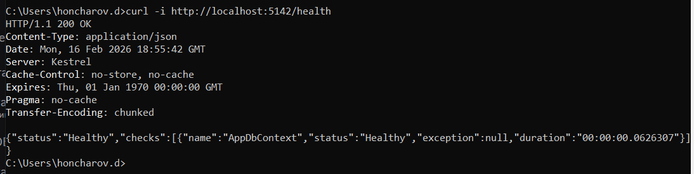
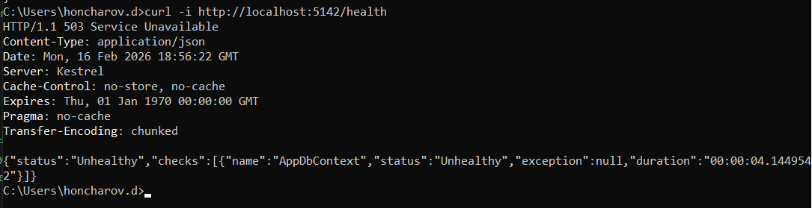

# weather-forecast
Опис проєкту
Це інтегрована система прогнозу погоди, що складається з бекенду. Система надає користувачам актуальні дані про погодні умови у реальному часі, а також прогнози на 5 днів. Основна мета проєкту — забезпечити швидкий доступ до точних погодних даних для підтримки прийняття рішень у повсякденній діяльності.

## Запуск проекту
Для того аби запустити проект потрібно виконати команду через cmd

```
dotnet run
```

Для того аби запустити тести потрібно виконати команду 
```
dotnet test
```

## Конфігурація середовища
Для коректно роботи застосунку потрібно вказати наступні змінні оточення:
* ConnectionStrings__DefaultConnection (Рядок підключення до Postgres бази даних. На сервері повинна попередньо бути створена база "forecast" )
* MainConfiguration__GeocodingApiKey (Апі ключ для додатку геокодування від Google)
* MainConfiguration__OpenWeatherApiKey (Апі ключ для OpenWeather)
* MainConfiguration__TelegramBotToken (Апі ключ для телеграм бота)
* MainConfiguration__InternalApiKey (Апі ключ для авторизації, повинен бути синхронізованим з клієнтом телеграм бота)

## Міграції
Система автоматично розгортає існуючі міграції за допомогою засобів Entity Framework Core

## HealtChecks

За ендпоінтом /health можна перевірити стан системи, якщо проблем немає ні з системою, ні з БД, то отримаємо 200 статус код з відповідним підтвердженя


У випадку, якщо є проблеми з підключенням до БД, то ми отримаємо помилку 503



## Логування

Логування відбувається в форматі JSON

Ось приклад логів 
```
{"Timestamp":"2026-02-16T20:46:50.1863775+02:00","Level":"Debug","MessageTemplate":"{State:l}","Properties":{"State":"Server mc-131:27584:3a21dd4c heartbeat successfully sent","SourceContext":"Hangfire.Server.ServerHeartbeatProcess","ApplicationName":"Weather forecast"},"Renderings":{"State":[{"Format":"l","Rendering":"Server mc-131:27584:3a21dd4c heartbeat successfully sent"}]}}

{"Timestamp":"2026-02-16T20:47:20.2117051+02:00","Level":"Debug","MessageTemplate":"{State:l}","Properties":{"State":"Server mc-131:27584:3a21dd4c heartbeat successfully sent","SourceContext":"Hangfire.Server.ServerHeartbeatProcess","ApplicationName":"Weather forecast"},"Renderings":{"State":[{"Format":"l","Rendering":"Server mc-131:27584:3a21dd4c heartbeat successfully sent"}]}}
```